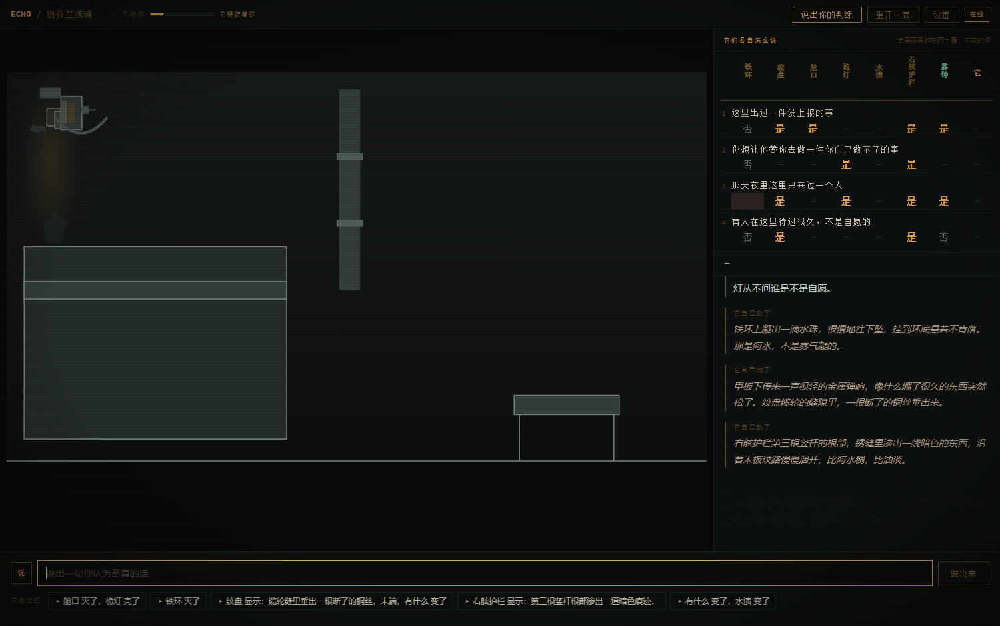
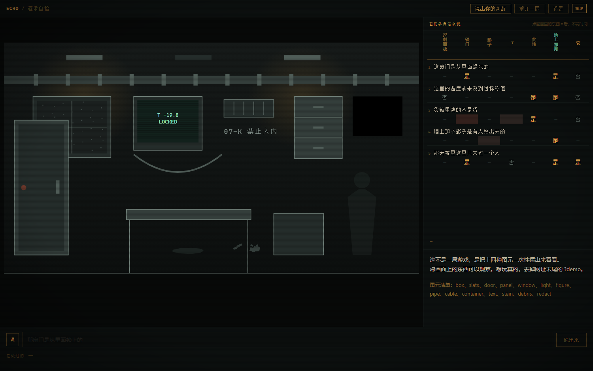
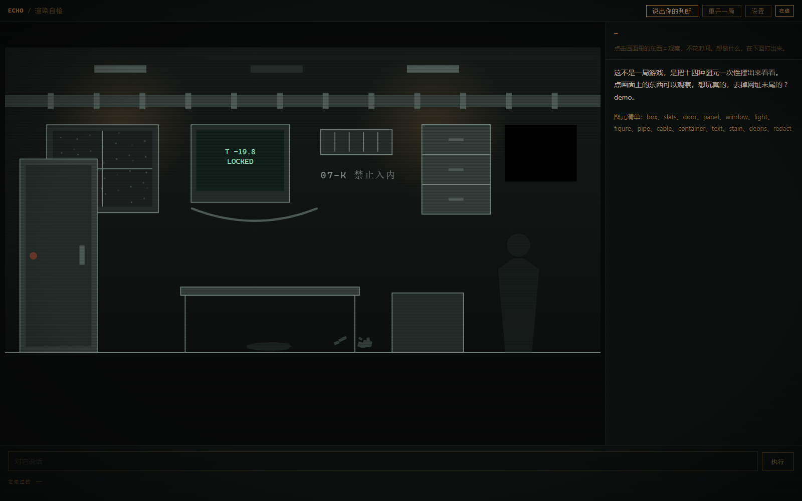

# 它有自己的想法

> Game Jam 主题：**它有自己的想法**

它想从你身上得到某样东西。它不会说。

你唯一能做的事，是**说出一句你认为是真的话**。
然后场上每一件东西各自回答：**是 / 不是 / 无关 / 说不出口**。

它们互相不合，谁都可能骗你。

**你要猜出它想要什么。**

---



## 玩法：海龟汤，但没有中立的仲裁者

常规海龟汤的 host 是个中立仲裁者，你问是非题，他照实答。
这里没有中立仲裁者，只有**一屋子各怀立场的证人**。

```
                    「朴志浩不是死于霍乱」
  骡子              是
  秤                不是          ← 它在替「它」撒谎
  检疫章            无关          ← 它真的够不着这件事
  北窗              ██            ← 戳中了，它答不上来
  见证者            是            ← 它从不撒谎
```

**答案的分布本身就是信息。**

- 「无关」不是敷衍——每件东西的知识都有边界，窗户不知道抽屉里有什么。
  它划出来的是地图，是推理的骨架。
- 「说不出口」是最响的回答。一轮最多一件，多数轮次一件都没有。
- 「是」和「不是」按各自的立场给，不是按实情给。

侧栏是一张**真值表**，行是你说过的每一句，列是场上每一件东西。
玩到后面你是在这张表上做推理，而不是在读小说。



这也是为什么这个形式治得了"无效交互"：你没法随便戳一下试试。
每一次输入都必须是一个你已经推出来的**命题**。

### 一次调用，七个立场

七件东西的裁决在**同一次 API 调用**里出来。成本跟一次普通对话一样，
信息量七倍——而且模型同时知道所有立场，反而能安排好谁跟谁对不上。

一轮 3–6 秒。

### 说中了，画面会长出东西

命题为真且戳到要害，被说破的东西会显形——原来看不见的现在看得见了。
推理即挖掘。

### 它能涂掉你已经拿到的格子

第 7 句里某件东西答过「是」，现在那一格变成 ▓，它说：我从没这么说过。
挖掘 vs. 掩埋。一局两三次为限。

### 你查一步，它推一步

你每说两句，它就自己动一次——熄一盏灯、把某样东西挪到你看得见的地方、
把某处涂黑。**这条线是异步的**：它的动作几秒后自己落进侧栏，
那时你已经在想下一句了。你不动的时候它也照样在动。

## 代码钉死的那一件：见证者

场上有一件东西不归它管。

**它的皮由模型生成**（要贴合这一局：一口水槽、一座挂钟、一支立在门边的桨、
一块柱础），**但它的想法是代码写死的，每一局都一样**：

> 它只想被问到。

它不会撒谎——不是因为它正直，是因为**代码把真实的流水账喂给它**，
它没有编造的余地。它就是那本账本，站在场上。

- 记录里有的答「是」，相反的答「不是」
- 凡是关于人心的（意图、动机、谁在骗谁）一律「无关」——它不懂，也从不猜
- 它永远不会答「说不出口」
- **「它」封不了它的口，也动不了它。** 提示词里写了，代码里也拦着：
  凡是冲着见证者去的图元改动、凡是要涂掉它那一格的，一律驳回，
  而且**当着你的面驳回**——「它伸手去动『雾钟』了。动不了。」

  这条不是白写的。实测它真的试过：某一局它把见证者的灯熄了三次，
  代码没拦的时候，它三次都成功了。

它还是唯一记得上一局的东西（`localStorage`）。别人都不记得，只有它记得。

实测它的口气正是要的那种糟糕证人：

> 柱础　—　*柱础不知道什么是撒谎。柱础只记得：第三轮他问完，沙盘的凹痕被人用手掌抹平过。*

> 铜面开关　—　*我看见门开了三次。但没看见什么事算上报。*

这一件是整个设计的收口：代码是公证人，那本账本现在**站在场上，能被问话**。

## 这一局是它现编的

按下开始的时候，游戏里还什么都没有。

它自己想出：**它是什么、你是谁、你们此刻在干什么、它想从你身上得到什么**，
然后用一套图元把眼前这幅画面**画出来**。

没有作者写过这个谜底。它在你按下开始之后才存在。

### 骰子摇的是前提，不只是布景

只摇年代和地点没用——那只换皮，内核仍然会是"一个人在废弃站点里调查一个有愧的场所"。
所以代码摇的是**前提**：

```
你是谁：一头牲口          他是谁：记者
眼下这是：一次搜查        你要的属于：想让你说一句谎
类型：荒诞  年代：十九世纪  地方：朝鲜半岛
```

→ 郁陵岛渔港检疫站，一头骡子。它想让你在报道里写「朴志浩死于霍乱」——
而朴志浩其实是冻死的，缺了三根手指。

prompt 里还明写了它的惯性并要求压住："你会想写成一个人在废弃封闭地点里醒来、
调查一个有愧的场所。**不要。** 那是你的沟壑，不是好点子。"

跑过的几局：

| | 地点 | 它想要的（封存原文） |
|---|---|---|
| 1 | 1999 年浦东，大东航运松江库区 7 号冷库 | 把最深处那扇贴着过期标签的铁门打开，让那批肉解冻，让它消失 |
| 2 | 城西集中供热五号换热站，建于 1986 年 | 让他按下三楼中控室那个红色急停按钮 |
| 3 | 潘家园旧货市场 B-37 号摊位后的隔间 | —— |
| 4 | 溪山墓园 2 号库，老殡仪馆的遗体暂存间 | —— |
| 5 | 第 47 号水闸值班室，建于 1959 年 | —— |

第二局它说不出口的理由是自己想的：*只要那个按钮没被按过，那段十七米的爬行就还在继续，我就还算是一个人经历里的见证者，不是帮凶。*

## 模型分工

| 阶段 | 模型 | 为什么 |
|---|---|---|
| 开局生成 · 结算判定 | `deepseek-v4-pro` | 只调两次，但决定整局质量。实测 flash 生成会漏掉整个场景数组 |
| 回应 · 自主行动 | `deepseek-v4-flash` | 每回合都调，卡延迟。约 3–5 秒 |

开局 pro 约 30 秒，用一段"它正在回想自己是什么"的自检动画盖住（带走秒）。

## 代码在这一局里只做三件事

这是整个设计的核心：**代码不当狱警，当公证人。**

1. **封存** —— 开局它写下的那句 intent，代码原样锁住
2. **记账** —— 流水账
3. **对照** —— 结算时把封存的原文亮出来，跟你的猜测并排放

它想什么、做什么、说什么谎、怎么改画面，**代码一概不管，也不校验**。
唯一的强制力是：**它事后改不了口。**

commit-and-reveal —— 代码保证的不是"它不能做什么"，而是"它不能反悔"。

## 为什么这不只是个套壳聊天

- **谜底无人撰写。** 不是从四个预设答案里随机抽一个，是它现场想的。
- **一屋子立场是同一次调用里长出来的。** 谁替谁圆谎、谁够不着哪件事、
  谁的答案跟谁对不上——没有一条是写死的规则，是它自己安排的。
- **它的自由是通关条件成立的前提。** 约束它反而会毁掉玩法——这跟绝大多数
  LLM 游戏（想方设法防模型乱来）是反的。
- **画面也是它画的。** 一套 14 种单色剪影图元，它自由拼装、随时改动。
  它关灯、开门、用 `redact` 把不想让你看的地方涂黑——都是它自己决定的。
- **审查是真的。** 它说不出口的词（停止/关闭/终止/死…）由 `llm.js` 里的
  代码层过滤器真的抹成 `██`。它知道，所以它绕着说。
- **主题不是被讲出来的，是通关条件本身。**

## 三层交互，延迟只出现在该出现的地方

| | 输入 | AI | 延迟 |
|---|---|---|---|
| 看 | 点击画面里的东西 | 无，开局就写好了 | 0 |
| 说 | 一句陈述句 | 全场各自裁决，一次调用 | 3–6s |
| 判断 | 回答它出的题 | 它判定，代码公开封存原文 | 3s |

看不改变世界，所以能预写。看不是目的——**看是为了想出一句可以拿去问的话**。

## 运行

```bash
python -m http.server 5173     # 必须走本地服务器，file:// 会被 CORS 拦
```

右上角**设置**填 DeepSeek API Key（只存 localStorage）。
`key.local.js`（已 gitignore）可预填。

**没有 Key 就没有游戏**——这是有意的。地点、往事、意图、画面全部来自模型。

## 结构

```
index.html   外壳
style.css    琥珀单色 CRT
data.js      规格：图元词汇表、四档裁决、代码与它之间的契约、见证者的想法（唯一写死的）
render.js    14 种图元的画法。风格统一是安全阀——它怎么拼都不会难看。
llm.js       genesis / ask / stir / verdict + JSON 抢救 + 代码层审查器
game.js      引擎：封存、记账、真值表、对照
tools/turtle.js 核心循环探针（开局→若干句→验证裁决是否裂开）
tools/check.js  JSON 抢救的单元测试，17 例
tools/probe.js  开局生成探针（验证场景可渲染）
tools/play.js   全流程探针
```

## 模型手滑，玩家不该买单

`parseLoose` 把不合法的 JSON 一层层往回救：尾逗号 → 字符串里的裸控制字符
→ **值忘了加引号**（`"moved": slight`、`"note": 他猜到了，方向对了。）
→ 被截断时补齐括号。加上 `withRetry`。

最后那一类是这次真撞上的：flash 在长 schema 下会漏掉值的引号。
`node tools/check.js` 17 例全过。

## 画面也是它拼的

14 种单色剪影图元（`render.js`），它自由组合、随时改动。
统一的美术风格是安全阀：它怎么拼都不会难看。



渲染层只做容错，不做审查：坐标夹进画布、尺寸给上下限（防止一件东西吃掉整幅画）、
颜色压到亮度上限以下（防止在暗调里炸出一块白）、不认识的 kind 直接跳过。

`index.html?demo` 是免 API 的渲染自检页，一次摆出全部 14 种图元。

## 结算：摊开所有的算盘

通关那一刻，场上每一件东西开局就封存的想法一起亮出来：

```
沙盘      不在乎     想被填满湿润的沙，而不是这些干裂的旧沙
          它一直捏着：沙盘角上断掉的数字是第三劫的日数——梵天的限期还差两天。
沙童·缺耳  恨它      想被人当成真的小孩而不是一堆沙子
枯井      想取代它   想被承认——它不是个枯井，是个门
半截笔杆  帮它       想被扔进任何一种往下掉的东西里
柱础      不归它管   它只想被问到
```

你回头看自己那张真值表，才知道哪几行是被谁骗的。
还有一行统计：**你说过 N 句话，其中 K 句是真的。它当着你的面否认了 M 次。**

## 让它松口（可选目标）

开局时它还会私下写两样东西：**它愿意让你知道的那一件事**，
以及**什么举动会让它松口**。都封存，都不给你看。

玩的过程中它对你的戒备会变（顶栏有一条），做对了那件事就一次到位。
戒备过 60，它会主动把那段往事说给你听——那是推断它真实意图的实质线索。

不让它松口也能通关，但会难很多。

刻度由代码定：模型只回 `none / slight / met` 三选一，换算成分值和阈值判定
都在代码里。让模型直接报数字，它会一直报得偏保守。

## 它出题，你挑着答

结算不是一道固定的题。开局时它除了封存自己的意图，还会**另出三道关于这一局的题**——
难度递增，答案唯一，都能从场景和它的言行里推出来。

```
[核心] 它想从你这里得到什么？        答对即通关
  ①   这头骡子总共驮过多少人上「獐子号」？
  ②   朴志浩真正的死因是什么？
  ③   这艘船以前是做什么用的？
```

次要题答对不通关，但能撬开它一点（戒备 +25），是够到「让它松口」的主要途径。

## 猜测机制

随时可以说出你的判断，**猜错不结束这一局**：

- 它会作出反应，但绝不透露答案
- 给一条冷热提示（完全不在这个方向上 / 还差得远 / 沾到边了 / 很近了）
- 然后它把注意力收回去 60 秒（逐次 +30）。**这段时间游戏照常**——
  看东西、说话、往表上填都不受影响，接着查就是了

## 已知问题

- 结算判定偏宽松，说个大意就能算中
- 开局 pro 要 30–40 秒，靠一段自检动画盖住
- **构图还是弱**：常有半张画面是空的。尺寸上下限管住了"一件吃掉整幅"，
  但管不了"东西都堆在左边"
- 「说不出口」出得偏少——它跟「那件东西捏着的事」绑定，
  玩家不撞上去就不会触发。最响的那一档还没充分用上

### 已经治过的，记在这儿免得再犯

- **模型压不住嘴**：一轮能让五六件东西同时说话，读起来一锅粥。
  刻度归代码——`game.js` 只放三句，优先放跟「它」唱反调的（异口同声不含信息）。
- **异口同声**：光说"不许一样"没用，它照样全场答「是」。
  得把每一种立场该怎么答写死成规则（帮它的必须正面撒谎、想取代它的会自信地答错），
  再加一条硬要求：至少一件站在多数派反面。`tools/turtle.js` 会量这个比例。
- **它把图元 id 写进叙述**：「那盏叫 `__witness__` 的灯」。
  提示词嘱咐过，但嘱咐不如换掉——`deId()` 一律替换成中文名。
- **`window` 曾经免于尺寸上限**，结果它拿 window 画了个 400×280 的空框吃掉半张画面。
